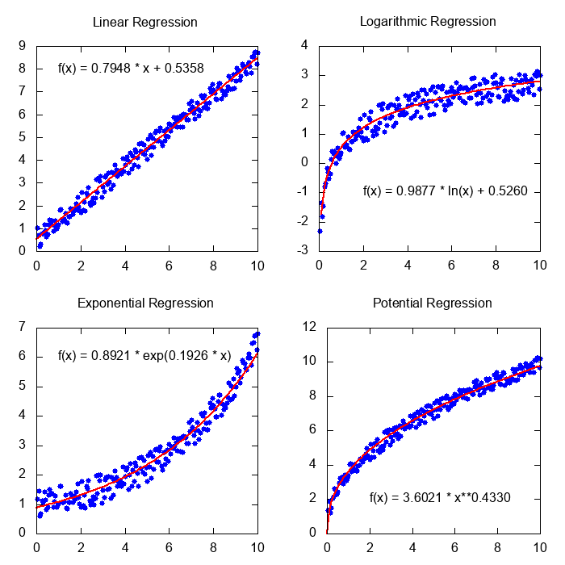

title: Load data and calculate regression coefficients.
author: Emilio Castro
date: 12/01/2021

## Description ##

This example illustrates the use of ```[[FU_Prec]]```, ```[[FU_Files]]``` and ```[[FU_Statistics]]``` modules using a simple program.
It reads a dataset from an external file with the proper format and performs different types of regressions to adjust the data.

The dataset can be downloaded [here](example3.dat). As stated in the documentation of ```[[readMatrix]]``` the file must have the following format:
The first line indicates the number of rows, columns and the presence of a header line in the second line.
In this example, the second line of the file is a header, which will be automatically skipped.
After that, the values of the matrix are given.
The first lines of this dataset file are:

```Text
{!documentation/Examples/Example03/example3simple.dat!}
```


## Functions used ##

* ```[[FU_Prec]]```.
    * ```dp```
* ```[[FU_Files]]```.
    * ```[[readMatrix]]```
* ```[[FU_Statistics]]```.
    * ```[[linreg]]```
    * ```[[logreg]]```
    * ```[[expreg]]```
    * ```[[potreg]]```

## Code ##

```Fortran
{!documentation/Examples/Example03/example3.f90!}
```

## Compilation ##

Compile using the following command. Adjust paths accordingly.

```Text
gfortran example3.f90 -o example3 -I/path/to/include/ -lFortranUtilities -L/path/to/lib/ -O2
```

## Execution ##

Before running, since it has been compiled against the shared library:

```Text
export LD_LIBRARY_PATH=/path/to/lib:${LD_LIBRARY_PATH}
```

Then run with:

```Text
./example3
```

The output of the execution is:

```Text
Linear regression:      f(x) = 0.7948 x + 0.5358.      Determination coefficient R2 = 0.9846
Logarithmic regression: f(x) = 0.9877 ln(x) + 0.5260.  Determination coefficient R2 = 0.9150
Exponential regression: f(x) = 0.8921 exp(0.1926x).    Determination coefficient R2 = 0.9214
Potential regression:   f(x) = 3.6021 x^0.4330.        Determination coefficient R2 = 0.9764
```

These results and the dataset can be plotted using a external tool to see the adjustment:


