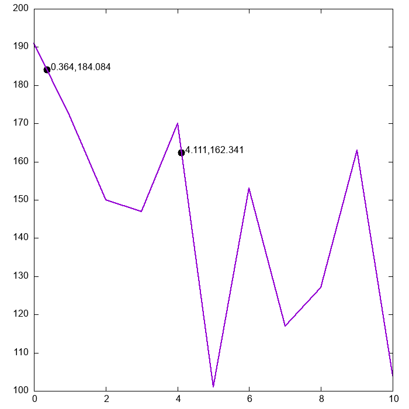

title: Load data and perform linear interpolation.
author: Emilio Castro
date: 25/11/2022

## Description ##

This example illustrates the use of ```[[FU_Prec]]```, ```[[FU_Files]]``` and ```[[FU_Interpolation]]``` modules using a simple program.
It reads a dataset from an external file with the proper format and performs linear interpolation to obtain some intermediate values.

The dataset can be downloaded [here](example4.dat). As stated in the documentation of ```[[readMatrix]]``` the file must have the following format:
The first line indicates the number of rows, columns and the presence of a header line in the second line.
In this example, the second line of the file is a header, which will be automatically skipped.
After that, the values of the matrix are given.
The content of the file is:

```Text
{!documentation/Examples/Example04/example4.dat!}
```


## Functions used ##

* ```[[FU_Prec]]```.
    * ```dp```
* ```[[FU_Files]]```.
    * ```[[readMatrix]]```
* ```[[FU_Interpolation]]```.
    * ```[[lin_interp]]```

## Code ##

```Fortran
{!documentation/Examples/Example04/example4.f90!}
```

## Compilation ##

Compile using the following command. Adjust paths accordingly.

```Text
gfortran example4.f90 -o example4 -I/path/to/include/ -lFortranUtilities -L/path/to/lib/ -O2
```

## Execution ##

Before running, since it has been compiled against the shared library:

```Text
export LD_LIBRARY_PATH=/path/to/lib:${LD_LIBRARY_PATH}
```

Then run with:

```Text
./example4
```

The output of the execution is:

```Text
 Value at x=0.364 is    184.08400000000000
 Value at x=4.111 is    162.34100000000001
```

These results and the dataset can be plotted using a external tool to see the adjustment:


